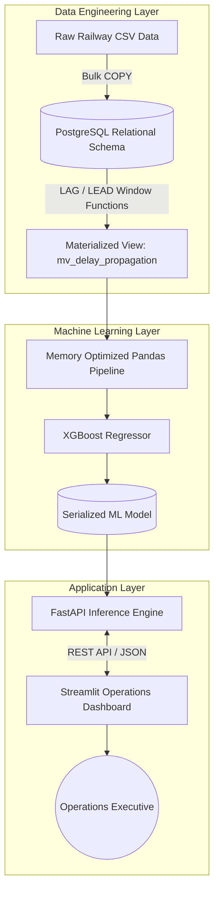

# 🚆 RailOptima

### Predictive Operations & Schedule Optimization Engine for Indian Railways

<div align="center">

**Big Data Analytics • Machine Learning • Operational Intelligence • Microservices**

*Transforming historical railway telemetry into real-time operational decisions.*

<br/>

[](http://congnixai-indian-railway-optimization.hf.space)
[](https://congnixai-indian-railway-optimzation-backend.hf.space)


</div>

---

# 📌 Overview

Indian Railways operates one of the largest and most complex transportation networks in the world.
Even minor disruptions at one station can propagate into large-scale operational delays across the network.

**RailOptima** is a predictive analytics platform designed to simulate, predict, and optimize railway scheduling decisions using historical telemetry data and machine learning.

Instead of simply identifying whether a train will be delayed, the system estimates:

* Predicted delay duration
* Delay propagation patterns
* Operational scheduling buffers
* Station-level congestion impact

The platform combines:

* **PostgreSQL-based big data engineering**
* **Memory-optimized machine learning pipelines**
* **FastAPI inference services**
* **Interactive Streamlit dashboards**

to create a deployable railway operations intelligence system.

---

# 🎯 Business Problem

Traditional railway schedules are largely static and reactive.

This creates several operational challenges:

| Problem                          | Operational Impact                         |
| -------------------------------- | ------------------------------------------ |
| Cascading delays                 | Minor disruptions multiply across stations |
| Fixed timetable assumptions      | Poor adaptation to real-time congestion    |
| Limited predictive visibility    | Reactive instead of proactive operations   |
| Large-scale telemetry complexity | Difficult to process efficiently           |

---

# 💡 Solution Architecture

RailOptima converts **~35.5 million historical telemetry records** into actionable operational recommendations.

### Core Capabilities

✔ Predicts train delay duration using machine learning<br>
✔ Models sequential delay propagation using SQL window functions<br>
✔ Reduces high-memory processing workloads by **87%**<br>
✔ Generates intelligent scheduling buffer recommendations<br>
✔ Exposes predictions through scalable microservices architecture<br>
✔ Delivers executive-friendly operational dashboards

---

# ⚡ Key Highlights

| Capability               | Implementation                                   |
| ------------------------ | ------------------------------------------------ |
| **Dataset Scale**        | ~35.5 Million telemetry records                  |
| **RAM Optimization**     | Reduced memory usage from ~13GB → ~0.96GB        |
| **ML Model**             | XGBoost Regressor                                |
| **Prediction Accuracy**  | MAE: 9.17 minutes                                |
| **Architecture**         | FastAPI + Streamlit microservices                |
| **Database Engineering** | PostgreSQL Materialized Views + Window Functions |
| **Deployment**           | Hugging Face Spaces                              |

---

# 🏗️ System Architecture



---

# 🧠 Machine Learning Pipeline

## Delay Prediction Engine

The predictive layer uses an optimized **XGBoost Regressor** trained on engineered railway telemetry features.

### Feature Engineering

* Previous station delay propagation
* Distance from origin
* Station sequencing
* Temporal scheduling metrics
* Weekend / weekday behavior
* Arrival hour patterns

### Performance Optimization

Handling 35M+ rows using standard processing pipelines caused memory exhaustion.

To address this:

* Aggressive datatype downcasting was applied
* Vectorized Pandas operations replaced iterative processing
* Heavy aggregations were shifted into PostgreSQL materialized views
* `tree_method='hist'` accelerated model training

### Result

| Metric           | Value             |
| ---------------- | ----------------- |
| Memory Reduction | 87%               |
| Final RAM Usage  | ~0.96 GB          |
| Model            | XGBoost Regressor |
| MAE              | 9.17 Minutes      |

---

# 🔌 Microservices Architecture

## ⚙️ FastAPI Backend

The backend functions as a dedicated inference engine.

### Responsibilities

* Model inference
* Payload validation using Pydantic
* REST API response handling
* Schedule buffer business logic

### Business Logic Layer

Predicted delays are transformed into operational recommendations using:

* Safety factor scaling (`1.15x`)
* Rounded scheduling blocks
* Executive-friendly outputs

---

## 🖥️ Streamlit Frontend

An executive-facing operational dashboard designed for usability and rapid simulation.

### Features

* Real-time prediction requests
* Interactive telemetry adjustment
* JSON payload drop interface
* Clean operational analytics UI
* FastAPI integration

---

# 🛠️ Tech Stack

| Layer                  | Technologies               |
| ---------------------- | -------------------------- |
| **Database & ETL**     | PostgreSQL, pgAdmin        |
| **Data Processing**    | Python, Pandas, NumPy      |
| **Machine Learning**   | Scikit-Learn, XGBoost      |
| **Backend API**        | FastAPI, Pydantic, Uvicorn |
| **Frontend Dashboard** | Streamlit, Requests        |
| **Deployment**         | Hugging Face Spaces        |

---

# 🌐 Live Deployment

## 🚀 Frontend Dashboard

**Operations Control Panel**
👉 [http://congnixai-indian-railway-optimization.hf.space](http://congnixai-indian-railway-optimization.hf.space)

---

## ⚡ Backend API

**FastAPI Inference Engine**
👉 [https://congnixai-indian-railway-optimzation-backend.hf.space](https://congnixai-indian-railway-optimzation-backend.hf.space)

---

# 📸 Application Preview

## 🖥️ Executive Operations Dashboard


> Interactive dashboard allowing operational teams to simulate railway conditions and receive AI-driven scheduling recommendations.

---

## ⚙️ FastAPI Swagger Documentation


> Fully documented API endpoints with request validation, JSON testing, and real-time prediction responses.

---

# 📂 Project Structure

```txt
Indian-Railways-Optimizer/
│
├── README.md
│
├── data_engineering/
│   ├── 01_table_schemas.sql
│   ├── 02_data_import.sql
│   └── 03_materialized_views.sql
│
├── machine_learning/
│   ├── memory_optimization.ipynb
│   ├── xgboost_training.ipynb
│   └── xgboost_delay_model.pkl
│
├── backend/
│   ├── backend.py
│   └── requirements.txt
│
└── frontend/
    ├── frontend.py
    ├── demo_scenarios.json
    └── requirements.txt
```

---

# 🚀 Local Setup

## 1️⃣ Clone Repository

```bash
git clone https://github.com/shubham001official/Indian-Railways-Optimizer.git

cd Indian-Railways-Optimizer
```

---

## 2️⃣ Start FastAPI Backend

```bash
cd backend

pip install -r requirements.txt

uvicorn backend:app --reload
```

Backend runs on:

```txt
http://localhost:8000
```

---

## 3️⃣ Launch Streamlit Frontend

Open a new terminal:

```bash
cd frontend

pip install -r requirements.txt

streamlit run frontend.py
```

Frontend runs on:

```txt
http://localhost:8501
```

---

# 🧪 Sample Prediction Payloads

## 🌫️ Scenario A — Winter Fog Delay Risk

```json
{
  "train_no": 13252,
  "station_no": 3,
  "distance_from_origin": 621.0,
  "prev_station_delay_mins": 21,
  "month": 1,
  "day_of_week": 4,
  "is_weekend": 0,
  "arrival_hour": 9,
  "distance_from_prev_station": 197.0
}
```

---

## ☀️ Scenario B — Efficient / On-Time Route

```json
{
  "train_no": 59605,
  "station_no": 12,
  "distance_from_origin": 124.0,
  "prev_station_delay_mins": 0,
  "month": 3,
  "day_of_week": 1,
  "is_weekend": 0,
  "arrival_hour": 20,
  "distance_from_prev_station": 11.0
}
```

---

# 📈 Future Enhancements

* [ ] Real-time NTES API integration
* [ ] Network-wide bottleneck heatmaps
* [ ] Docker Compose deployment
* [ ] Role-based authentication
* [ ] Live operational alerting
* [ ] Advanced congestion forecasting
* [ ] Geo-visualization using Plotly + Folium

---

# 👨‍💻 Author

## Shubham Sharma

**MBA — Business Analytics**
Focused on building scalable analytics systems that combine:

* Data Engineering
* Machine Learning
* Operational Intelligence
* Business Decision Systems

---

<div align="center">

### ⭐ If you found this project valuable, consider starring the repository.

</div>
